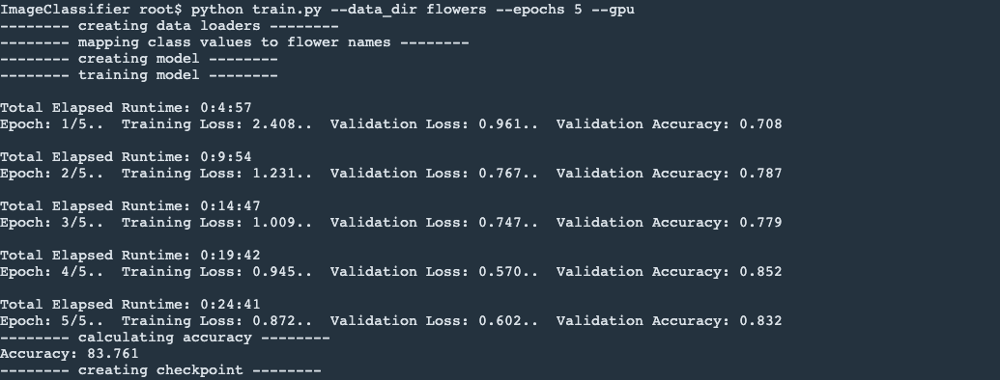
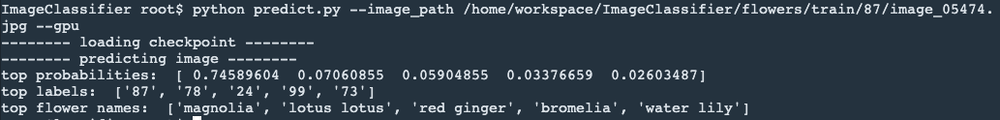
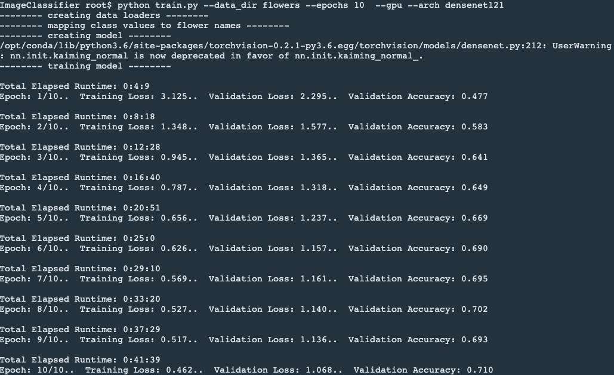
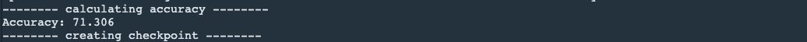
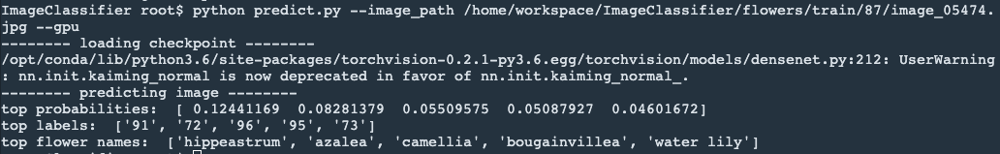

The following are the console outputs when I ran my scripts. I did not get to run over 20 epochs because I ran out of GPU time.

# vgg16 model:
## train.py

## predict.py

# densenet121 model:
## train.py

## predict.py

